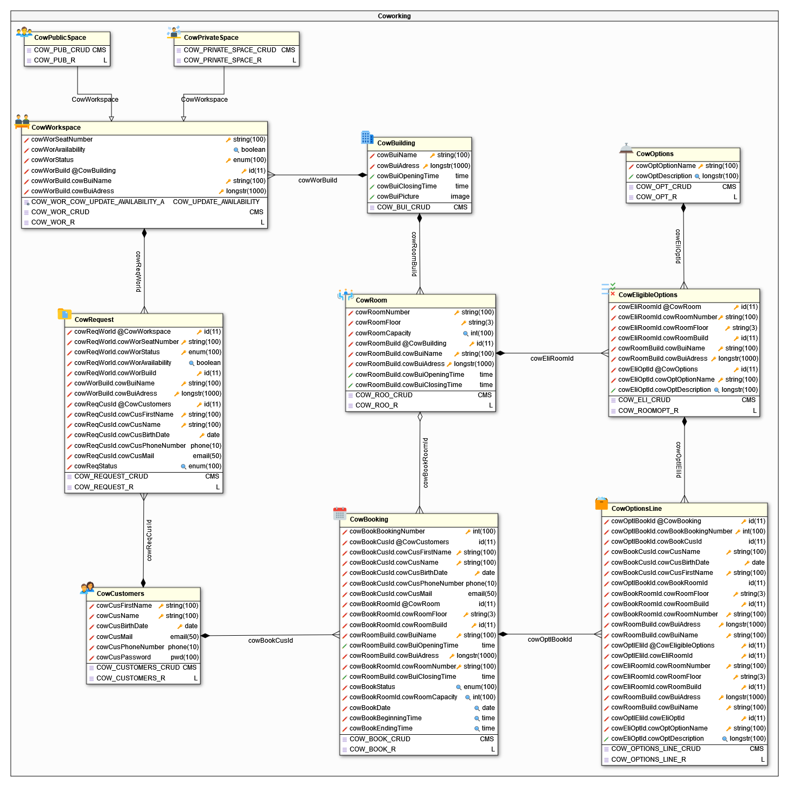
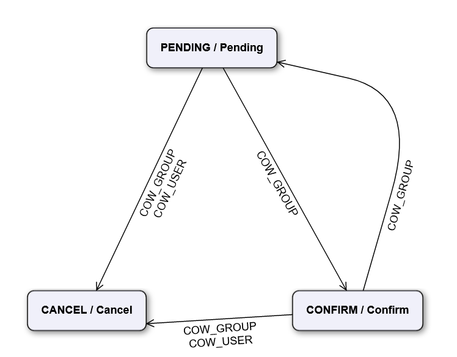
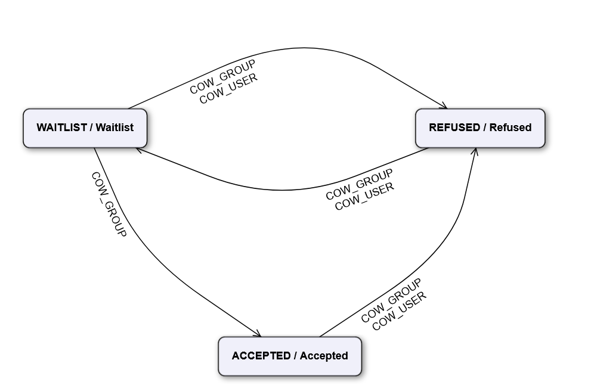

<h1> Business case </h1>

The business case is a coworking business gestion's application.

The application has one backend user interface which is based on the standard Simplicité® user interface. This user interface is only used by internal users to manage reference data (buildings info, rooms, seats...) and to enter and manage customer bookings and requests.

It also has various public frontend user interfaces which allow customers to book rooms or request seat.

Some business rules, including right rules, applies on all business objects some of which depends on the user profile.

The 2 back office business user profiles are administrator and plain user. Administrators manages all reference data, enters and/or validate requests and bookings. Plain users are only responsible for booking rooms or requesting seats.

<h2>Business data </h2>

The data model consists of 9 business objects: 
<ul>
  <li>Customers who can create bookings and requests for seats</li>
  <li>Requets which are created by customers and are linked to one seat in a workspace</li>
  <li>Worspaces which can be either public or private, they are in one building and requests can be made for them</li>
  <li>Buildings which have rooms and workspaces</li>
  <li>Rooms which are in a building. They have eligible options</li>
  <li>Eligible options are linked to one option and one room and can be found in options line </li>
  <li>Options which are only linked to eligible options </li>
  <li>Options line which designate the options found in a booking for the room which has eligible options </li>
  <li>Bookings which are linked to one customer, one room and have options</li>
</ul>
  <h2>User profiles</h2>
  
  The <strong>Administator</strong> profile is a back office profile. He has full acces to all the application. He can manage all data and he's the only one reponsible of the confirmations of requests or bookings.
  
  The <strong>Customer</strong> is a front office profile. He has only access to dedicated custom user interfarces. He is only allowed to requests seats, book a room or see his informations and cancel his bookings or workspace places.
  
<h2>Business workflows</h2>
    
<h3>Booking states</h3>
  
  
COW_GROUP designates the administrator while COW_USER designates the user.
Bookings can be in following statuses: 
  <ul>
  <li><strong>Pending</strong> as the initial status
  <li><strong>Confirmed</strong> when confirmed by the administrator
  <li><strong>Cancelled</strong> if cancelled 
  
<h3>Request states</h3>
  
    
Same designations than for Booking states.
    
Requests can be in following statuses:
<ul>
  <li><strong>Waitlist</strong> as the initial status</li>
  <li><strong>Accepted</strong> when accepted by the administrator</li>
  <li><strong>Refused</strong> if the administrator refuses the request or the customer resiliates his place</li>

  <h2>Business rules</h2>
  <h3>Buildings related business rules</h3>
  Building can only be created and updated by the administrator profile.
  
  <h3>Workspace related business rules</h3>
  Workspace can only be created by the administrator profile.
  
  <h3>Request related business rules</h3>
  Requests can be created updated or deleted by both the admnistator profile and the user profile.
  
  <h3>Customers related business rules</h3>
  A customer can be created by both the admnistrator and user profile but can only be updated by the administrator profile (except the pass word which can be updated by both).
  
  <h3>Booking related business rules</h3>
  A booking have multiples business rules:
  <ul>
    <li>The booking date must be after the current date or the booking time must be after the current time (only if the date is the current date).</li>
    <li>The booking has a beginning and an ending which cannot be before the building time or after the building closing time.</li>
    <li>A booking cannot be modified by the user if it is already confirmed</li>
  </ul>
  
  <h3>Option Line related business rules</h3>
  Each booking can have multiples options line, but each of them must refer only to an eligible option from the booking's room.
  
  <h3>Eligible option related business rules</h3>
  An eligible option is one option eligible for one room.
  It is placed by an administrator profile.
  
  <h3>Options related business rules </h3>
  An option is created by an admnistrator profile. It is eligible multiple times.
  
  <h3>Room related business rules</h3>
  A room is created by an administrator profile.
  A room is in one building. Each room has a number which is unique per building.
  Multiple bookings can be placed on one room, but not in the same time.
  
  <h1>Front end</h1>
  
  As said earlier, this application has a front end destined to the customer. This front-end is designed for phone usage.
  This front allow the user to connect himself or to register a new account.
  He then can consult his bookings, previous or to come and can cancel the bookings to come as well as his seat requests.
  
  There is two buttons, "Get a seat" and "Get a room". They are self-explainatory. When you click on one of them, the buildings appear and you can choose and search the one you're looking for. You then can proceed to select your room or your seat and make the request or the booking.
  
